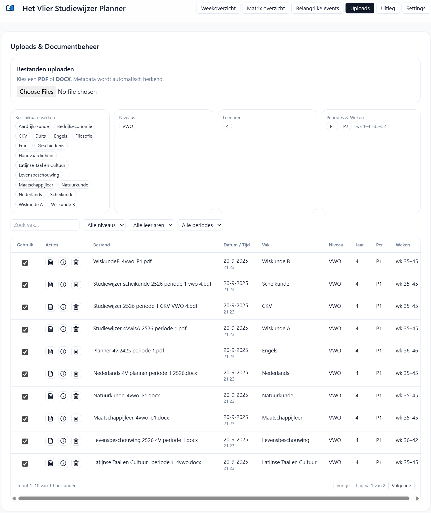

# Vlier Studiewijzer Planner

Vlier Planner helpt leerlingen en docenten om studiewijzers uit het voortgezet onderwijs overzichtelijk te plannen. Upload een studiewijzer (PDF of DOCX), bekijk per vak de lesstof, houd huiswerk bij en volg belangrijke events zoals toetsen en deadlines.

## Inhoud
1. [Functioneel overzicht](#functioneel-overzicht)
   - [Belangrijkste schermen](#belangrijkste-schermen)
   - [Kernfeatures](#kernfeatures)
   - [Onboarding tour](#onboarding-tour)
2. [Voorbeeldschermen](#voorbeeldschermen)
3. [Technische architectuur](#technische-architectuur)
4. [Projectstructuur](#projectstructuur)
5. [Installatie en ontwikkeling](#installatie-en-ontwikkeling)
6. [Gebruik van de applicatie](#gebruik-van-de-applicatie)
7. [Review-, versie- en updateflows](#review--versie--en-updateflows)
8. [Frontend-build koppelen](#frontend-build-koppelen)
9. [Alles-in-één backend](#alles-in-één-backend)
10. [Windows distributie](#windows-distributie)
11. [Licentie](#licentie)

## Functioneel overzicht
### Belangrijkste schermen
- **Weekoverzicht** – compacte lijst van vakken per week met huiswerk en lessen.
- **Matrix overzicht** – tabelweergave waarmee je meerdere weken naast elkaar kunt volgen.
- **Belangrijke events** – filterbare lijst met toetsen, presentaties en andere deadlines.
- **Uploads & instellingen** – beheer geüploade studiewijzers, zichtbare vakken, thema en app-instellingen.

### Kernfeatures
- Studiewijzers uploaden in PDF of DOCX en automatisch laten normaliseren.
- Handmatig huiswerk toevoegen, aanpassen en afvinken naast geïmporteerde items.
- Filteren op leerjaar, niveau en zelfgekozen vakselecties.
- Diff-overzichten en waarschuwingen tijdens reviews om wijzigingen en mogelijke problemen te tonen.
- Automatische updatecontrole met de mogelijkheid om nieuwe versies vanuit de applicatie te downloaden.
- Automatisch vakantieschema's ophalen om vrije dagen en vakanties meteen in de planning te verwerken.
- Zelf thema's ontwerpen en opslaan voor een gepersonaliseerde look & feel van de planner.
- Onboarding tour die nieuwe gebruikers stap voor stap door de belangrijkste schermen leidt.

### Onboarding tour
- Bij het eerste bezoek start een rondleiding met zes stappen: **Uitleg**, **Upload**, **Weekoverzicht**, **Matrix overzicht**, **Belangrijke events** en **Settings**.
- Enter of spatie gaat naar de volgende stap, Escape sluit de tour. Via het menu-item **Rondleiding** kun je de tour later opnieuw starten.
- De status wordt opgeslagen in `localStorage` onder de sleutel `vlier.tourDone`.

## Voorbeeldschermen
De onderstaande voorbeelden komen uit `frontend/public` en tonen de belangrijkste flows.

**Studiewijzer uploaden** – Upload een PDF of DOCX, bekijk een voorbeeld van de herkende secties en kies het leerjaar en de klas waarvoor het materiaal bedoeld is.



**Weekoverzicht** – Bekijk per week wat er gepland staat, voeg eigen taken toe en vink afgeronde taken af.


**Matrix overzicht** – Combineer meerdere weken in één grid zodat je trends per vak ziet en eenvoudig vooruit kunt plannen.


**Belangrijke events** – Filter toetsen, presentaties en andere deadlines en sorteer ze op datum of vak.


## Technische architectuur
### Backend
- Gebouwd met FastAPI en aangestuurd via één gedeeld entrypoint:
  - `backend/app.py` bevat de volledige workflow-backend inclusief normalisatie, studiewijzerbeheer, updates en vakantie-endpoints. Deze module wordt rechtstreeks gebruikt door zowel de Windows-executable (`run_app.py`) als lokale `uvicorn`-sessies.
  - `backend/main.py` levert de afgeslankte *planner-API* voor scripts die uitsluitend de genormaliseerde data en agenda-/matrixoverzichten nodig hebben. De module deelt opslag en helpers met `backend.app`, waardoor beide varianten dezelfde data zien.
- Dankzij dit onderscheid kies je bewust welke API je start, zonder verschillende codepaden of compatibiliteitslagen in stand te houden.
- `backend/services/data_store.py` beheert de opslag van uploads, pending parses, genormaliseerde modellen en het state-bestand. Via `VLIER_DATA_DIR` of `VLIER_STORAGE_DIR` kan de opslaglocatie worden geconfigureerd.
- `backend/school_vacations.py` haalt vakantieperiodes op bij rijksoverheid.nl met `httpx` en `lxml`, structureert de uitkomsten en levert ze via `/api/school-vacations` aan de frontend.
- `backend/update_checker.py` en `backend/updater.py` verzorgen versiecontrole en het uitvoeren van applicatie-updates vanuit de UI.

Beide modules gebruiken dezelfde code en opslag; je kiest per scenario welke API het beste past. Voor dagelijks gebruik en distributies draait alles op `backend.app:app`, terwijl `backend.main:app` handig is voor geautomatiseerde normalisatie of analyse-scripts.

### Frontend
- Gebouwd met React, Vite en Tailwind CSS.
- Router-gedreven pagina’s voor uploads en reviews, week- en matrixoverzichten, events, instellingen (inclusief thema-editor) en de onboarding-tour.
- `frontend/src/app/store.ts` beheert applicatiestatus zoals gebruikersvoorkeuren, thema’s, imports en synchronisatie met de backend-API.
- Communiceert via REST API’s voor data, diff-waarschuwingen, vakantiegegevens en update-notificaties.

### Parser en normalisatie
- `backend/parsers/parser_docx.py` en `backend/parsers/parser_pdf.py` extraheren metadata, weken, toetsen, huiswerk en URLs uit DOCX- en PDF-studiewijzers. PDF-ondersteuning gebruikt `pdfplumber` met een `PyPDF2`-fallback.
- `vlier_parser/normalize.py` zet geparste bestanden om naar het genormaliseerde `NormalizedModel`, voegt waarschuwingen toe en bewaart resultaten via de `DataStore` zodat week-, matrix- en agendaweergaven direct te voeden zijn.
- `backend/study_guides.py` bewaakt versies per studiewijzer, berekent diffs, houdt waarschuwingen bij en koppelt bestanden aan stabiele identifiers voor de reviewflow.

Alle parsers delen nu één `BaseParser` met `RawEntry`-objecten. Hierdoor hebben PDF en DOCX dezelfde week- en datumherkenning, sleutelwoorden en deadline-heuristieken. De trefwoorden staan in `backend/parsers/config.py` en zijn optioneel te overschrijven via `VLIER_PARSER_KEYWORDS=/pad/naar/keywords.json`.

### Dataflows
- Zowel de snelle normalisatie-API als de volledige workflow schrijven naar dezelfde opslagstructuur (`backend/storage/`).
- Goedgekeurde versies worden per studiewijzer en versie-id opgeslagen zodat diffing en historische downloads beschikbaar blijven.

## Projectstructuur
```
vlier-planner/
  backend/      FastAPI-backend en opslagservices
  frontend/     React/Vite/Tailwind frontend
  docs/         Documentatie en handleidingen
  samples/      Voorbeeldbestanden voor testen
  tools/        Hulpscripts (build, utilities)
```

## Installatie en ontwikkeling
### Basisinstallatie
```bash
python -m venv .venv && source .venv/bin/activate
pip install -r backend/requirements.txt
uvicorn backend.app:app --reload

cd frontend
npm install
npm run dev
```

### Versiebeheer synchroniseren
De applicatieversie staat in `VERSION.ini` onder `[app]`. Gebruik `npm run sync-version` (of een script dat `tools/sync-version.mjs` aanroept) om `package.json` en `package-lock.json` automatisch bij te werken op basis van deze waarde.

### Tests en kwaliteitscontroles
- Backend-tests: `pytest`
- Frontend-tests: `npm test`
- Specifieke parser- of normalisatietests kun je draaien met `pytest -k normalize` zodra echte parserlogica aanwezig is.

### Voorbeelddocumenten ophalen
1. Plaats je gedeelde OneDrive- of Google Drive-link in `.env` onder `ONEDRIVE_SHARE_URL`.
2. Voer `python tools/fetch_onedrive_folder.py` uit; de ZIP wordt automatisch opgehaald en uitgepakt naar `samples/`.
3. Controleer alle bestanden met `python tools/parse_samples.py` om zeker te weten dat alle periodes zonder fouten worden ingelezen.

## Gebruik van de applicatie

### Eerste keer opstarten
1. Start de backend op poort 8000 via `uvicorn backend.app:app --reload`. Dit is dezelfde FastAPI-app als die in de Windows-versie verpakt zit.
   Heb je enkel de genormaliseerde planner-API nodig, gebruik dan `uvicorn backend.main:app --reload` in een aparte sessie.
2. Start de frontend op poort 5173 met `npm run dev` en open `http://localhost:5173`.
   Krijg je een verbinding geweigerd, start dan met `npm run dev -- --host 0.0.0.0`
   of navigeer expliciet naar `http://127.0.0.1:5173` zodat zowel IPv4- als IPv6-
   verbindingen werken.
3. Bij de eerste sessie start automatisch de onboarding-tour die de belangrijkste schermen toelicht; je kunt deze later opnieuw openen via het menu **Rondleiding**.

### Studiewijzer importeren en plannen
- Upload een DOCX- of PDF-studiewijzer via het tabblad **Uploads & Documentbeheer**. De backend normaliseert het document, detecteert vak, leerjaar, weken en toetsen en slaat het resultaat op.
- Ga naar **Weekoverzicht**, **Matrix** of **Belangrijke events** om ingeplande lessen, toetsen en huiswerk te bekijken. Voeg eigen taken toe, gebruik filters voor vak/niveau/leerjaar en vink afgeronde items af.
- Handmatige wijzigingen worden lokaal bewaard en gecombineerd met nieuwe versies zodra je een studiewijzer opnieuw importeert.

### Schoolvakanties en thema’s
- Gebruik het tabblad **Schoolvakanties** binnen de uploads-pagina om actuele vakantieperiodes bij de rijksoverheid op te halen. Selecteer de gewenste regio’s en importeer ze zodat vrije dagen direct zichtbaar zijn in week- en agendaweergaven.
- Open **Instellingen** om thema’s te beheren. Je kunt bestaande thema’s dupliceren, kleuren en achtergronden aanpassen en meerdere eigen thema’s opslaan voor verschillende doelgroepen.

### Versies beoordelen
- Nieuwe uploads verschijnen als concept in de reviewwizard met diff-samenvattingen, waarschuwingen (zoals ontbrekende weken of dubbele datums) en een documentpreview.
- Werk feedback direct af in het brondocument, upload een bijgewerkte versie en gebruik de wizard om wijzigingen goed te keuren of af te wijzen. Goedgekeurde versies worden opgeslagen met een oplopend versienummer en blijven beschikbaar voor historische downloads en diffs.

## Review-, versie- en updateflows
- **Reviewwizard** – `/api/reviews` en `/api/reviews/{parseId}` leveren pending reviews met metadata, regels, diff en waarschuwingen. De frontend toont deze in de uploads- en reviewpagina’s.
- **Versiebeheer** – Commits naar `/api/reviews/{parseId}/commit` bewaren nieuwe versies en houden diff-geschiedenis en bestanden per versie beschikbaar via `/api/docs/...`.
- **Automatische updates** – `/api/system/update` controleert op nieuwe releases. De frontend voert automatisch checks uit en biedt handmatige bediening via de instellingenpagina.
- **Windows-updateflow testen** – Raadpleeg [`docs/windows-update-testing.md`](docs/windows-update-testing.md) voor het doorlopen van de volledige updateketen met PyInstaller en Inno Setup.

## Frontend-build koppelen
Gebruik het hulpscript om de Vite-build in `backend/static/dist` te plaatsen wanneer je een distributieversie wilt maken:

```bash
python tools/build_frontend.py  # optioneel: --skip-install of --no-build
```

Het script draait standaard `npm install`, bouwt de frontend en kopieert de inhoud van `frontend/dist` naar `backend/static/dist`.

## Alles-in-één backend
Met `run_app.py` start je uvicorn, wordt automatisch statische frontend-serving ingeschakeld en opent er optioneel een browservenster.

```bash
python run_app.py
```

Handige omgevingsvariabelen:

- `VLIER_HOST` / `VLIER_PORT` – pas host of poort aan (standaard `127.0.0.1:8000`).
- `VLIER_OPEN_BROWSER=0` – onderdrukt het automatisch openen van een browser.
- `SERVE_FRONTEND=0` – forceert API-only modus (bijvoorbeeld voor lokale ontwikkeling met Vite).

### Logging tijdens ontwikkeling
- **Uvicorn-sessies** – start `uvicorn backend.app:app --reload --log-level info` zodat de `parser_pdf`-logs rechtstreeks in je terminal verschijnen. Gebruik `--log-level debug` als je ook de `LOGGER.debug`-regels wilt zien.
- **Alles-in-één backend (`run_app.py`)** – de backend schrijft automatisch naar `vlier-planner.log` in de projectroot (of naar het pad uit `VLIER_LOG_FILE`). Houd het bestand bij met `tail -f vlier-planner.log` (macOS/Linux) of `Get-Content -Path vlier-planner.log -Wait` (PowerShell). Zet `VLIER_LOG_LEVEL=DEBUG` om extra parserdetails zoals Camelot-flavorwissels te zien.

## Windows distributie
Volg deze stappen om een enkel `.exe`-bestand te maken voor Windows-gebruikers:

1. Zorg dat de frontend-build beschikbaar is in de backend:
   ```bash
   python tools/build_frontend.py
   ```
2. Installeer PyInstaller in je (virtuele) omgeving:
   ```bash
   pip install pyinstaller
   ```
3. Controleer de waarde in `VERSION.ini`. `VlierPlanner.spec` gebruikt deze om `build/file_version_info.txt` te genereren voor de Windows-version resource.
4. Bouw de executable vanuit de projectroot:
   ```bash
   pyinstaller run_app.py \
     --name VlierPlanner \
     --onefile \
     --noconsole \
     --noconfirm \
     --add-data "backend/static/dist;backend/static/dist" \
     --add-data "VERSION.ini;." \
     --collect-all vlier_parser \
     --collect-all backend.parsers
   ```
   Pas opties als `--add-data` of `--collect-all` aan wanneer extra pakketten of assets nodig zijn. Je kunt ook `pyinstaller VlierPlanner.spec` gebruiken; dezelfde version resource wordt dan automatisch toegevoegd.
5. Het resultaat vind je in `dist/VlierPlanner.exe`. Kopieer dit bestand naar een Windows-machine en start het met een dubbelklik; de app opent automatisch op `http://127.0.0.1:8000`.
6. (Optioneel) Gebruik Inno en "installer.iss" file voor het maken van een installer executable. Deze komt dan in "buils/installer/VlierPlanner-Setup-[version].exe" te staan.

## Licentie
MIT
